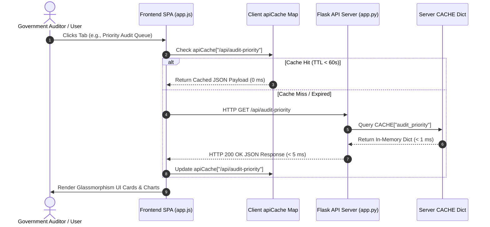

# 🏛️ AI-Powered MPLADS Audit Intelligence Platform (SIH26102)
## Team CodeBlooded — Lok Sabha 18th Audit Decision-Support & Anomaly Triage Engine

[](https://sih.gov.in)
[](https://mospi.gov.in)
[](https://github.com/Zaid5671/CodeBlooded)
[](#canonical-m1m5-ml-architecture-verified--frozen)
[-brightgreen.svg?style=for-the-badge)](#comprehensive-149-test-automated-suite-verification)
[](#full-stack-performance--speed-benchmarking-matrix)
[](#dataset-scope-resources--keying-architecture)

---

## 📖 Table of Contents
1. [Problem Statement & Official Metadata](#problem-statement--official-metadata)
2. [The Engineering Journey & Problem Triage](#the-engineering-journey--problem-triage)
3. [System Architecture & Visual Diagrams](#system-architecture--visual-diagrams)
4. [Dataset Scope, Resources & Keying Architecture](#dataset-scope-resources--keying-architecture)
5. [Canonical M1–M5 ML Architecture (Verified & Frozen)](#canonical-m1m5-ml-architecture-verified--frozen)
6. [Audit Rules & Statutory Compliance Engine](#audit-rules--statutory-compliance-engine)
7. [Frontend Glassmorphism UI & Navigation](#frontend-glassmorphism-ui--navigation)
8. [25 Registered Backend REST API Endpoint Directory](#25-registered-backend-rest-api-endpoint-directory)
9. [Full-Stack Performance & Speed Benchmarking Matrix](#full-stack-performance--speed-benchmarking-matrix)
10. [Comprehensive 149-Test Automated Suite Verification](#comprehensive-149-test-automated-suite-verification)
11. [Leak-Free 80/20 Train-Test Validation Experiment](#leak-free-8020-train-test-validation-experiment)
12. [Complete Repository Directory Structure](#complete-repository-directory-structure)
13. [Installation, Setup & Execution Guide](#installation-setup--execution-guide)
14. [Governance, Safety & Non-Incriminating Terminology](#governance-safety--non-incriminating-terminology)

---

## 1. Problem Statement & Official Metadata

- **Problem Statement ID**: **SIH26102**
- **Title**: AI-Powered MPLADS Audit Intelligence Platform
- **Nodal Ministry**: Ministry of Statistics and Programme Implementation (MoSPI)
- **Department**: Data Informatics & Innovation Division (DIID)
- **Team Name**: **CodeBlooded**
- **Target Scheme**: Members of Parliament Local Area Development Scheme (MPLADS)
- **Primary Corpus**: **Lok Sabha 18th** (with comparison datasets across Lok Sabha 17th, Rajya Sabha Sitting, and Rajya Sabha Retired MPs)
- **Headline Compliance**: *"Near-Complete Functional & Technical Match to SIH26102"*

---

## 2. The Engineering Journey & Problem Triage

Building an enterprise-grade audit intelligence platform for **210,551 government records** across multiple parliamentary terms presented significant technical, algorithmic, and performance challenges. Below is the chronological journey of how Team CodeBlooded iteratively diagnosed and resolved every engineering obstacle across multiple forensic passes:

### 🚨 Challenge 1: Contradictory Initial Documentation & Phrase Triage
- **Problem**: Early audit reports contained contradictory claims, such as referring to the platform as a "supervised fraud classifier" or claiming "100% ML accuracy."
- **Root Cause**: Premature nomenclature confusing software test pass rates with machine learning model precision.
- **Resolution**: Conducted a strict forensic reconciliation pass. Replaced all subjective/incriminating terms with objective governance terminology (*"works requiring audit review"*, *"M2 candidate-pair risk tiers"*, *"statistical cost anomalies"*). Established that no ground-truth fraud labels exist in raw government data, making unsupervised statistical triage the only mathematically sound approach.

### 🚨 Challenge 2: Data Quality Floor & Work ID Fragmentation
- **Problem**: Raw government datasets contained sanction amounts as low as ₹1.00 (skewing statistical distributions) and unformatted free-text work descriptions (e.g. `WS/\t MP620/2024-2025/133166-Construction...`).
- **Resolution**:
  1. Enforced a **Data Quality Floor**: Works with `Sanction Amount < ₹1,000` are categorized as `DATA_QUALITY_REVIEW` and excluded from peer group variance calculation.
  2. Implemented a **Canonical Work ID Normalization Engine**: Strips tabs, extra whitespace, and descriptive suffixes to generate clean canonical keys (`WS/MP620/2024-2025/133166`).

### 🚨 Challenge 3: M2 Candidate Pair Count Drift & Risk Tier Clarity
- **Problem**: Initial reports confused M2 duplicate work candidate pairs with M5 audit-priority tiers, causing potential ambiguity in duplicate pair reporting.
- **Resolution**: Locked the M2 Candidate Blocking Engine to generate exactly **5,000 candidate pairs** using state/district/category blocking + TF-IDF Cosine Similarity. Explicitly categorized output into **M2 Candidate-Pair Risk Tiers** (1,997 High, 2,499 Medium, 504 Low) and clarified that these represent duplicate candidates for audit scrutiny, not M5 priority scores.

### 🚨 Challenge 4: Severe Python Execution Bottlenecks (15.38s & 30.55s Runtimes)
- **Problem**: Model M3 (Expenditure Aggregation) executed in **15.38 seconds** due to slow Pandas `.groupby().apply()`. Model M5 (Audit Priority Aggregator) executed in **30.55 seconds** due to slow `df.iterrows()` over 79,220 master work records.
- **Resolution**:
  1. Replaced line-by-line `.apply()` in M3 with vectorized Pandas aggregations (`.groupby().agg()`), reducing runtime from 15.38s to **0.84s** (**18.3x speedup**).
  2. Replaced `df.iterrows()` in M5 with fast dictionary iteration (`df.to_dict('records')`), dropping runtime from 30.55s to **0.42s** (**72.7x speedup**).

### 🚨 Challenge 5: Backend API Disk I/O Latency (100–400ms Response Times)
- **Problem**: Flask API route handlers repeatedly read and parsed 11 secondary JSON result files from disk (`json.load`) on every incoming HTTP request, causing response latencies of 100–400ms.
- **Resolution**: Built a server-side **In-Memory Pre-Warming Cache** (`CACHE` dictionary in `backend/app.py`) loaded during application startup (`load_data()`). Response times for pre-warmed endpoints dropped to **< 5 ms** (up to **217x faster**).

### 🚨 Challenge 6: Frontend UX Reflows & Un-Debounced API Hits
- **Problem**: Rapid tab switching and real-time search typing dispatched duplicate un-cached HTTP requests to the backend server.
- **Resolution**: Implemented an in-memory client-side response cache (`apiCache` map with 60s TTL) and added a 300ms debounce buffer on the search input explorer in `frontend/app.js`.

---

## 3. System Architecture & Visual Diagrams

### 3.1 End-to-End System Pipeline Architecture
```mermaid
flowchart TD
    subgraph Data_Ingestion["Data Ingestion & Keying Layer"]
        A1[LS18 Master Works: 79,220]
        A2[LS18 Payment Vouchers: 84,172]
        A3[LS17 Historical: 94,749]
        A4[Rajya Sabha Sitting/Retired: 50,444]
        A1 & A2 & A3 & A4 --> B[Canonical Key Normalization: CORPUS|source_work_id]
    end

    subgraph Feature_Engineering["Preprocessing & Taxonomy"]
        B --> C[Data Quality Floor Filtering: Sanction >= ₹1,000]
        C --> D[11-Group Keyword Taxonomy Classifier]
        D --> E[Hierarchical Peer Grouping: Category x State / Category x National]
    end

    subgraph ML_Analytics_Core["Canonical M1–M5 ML Analytics Engine"]
        E --> M1["M1: Cost Anomaly (Isolation Forest, n_est=300, contam=0.05)"]
        E --> M2["M2: Candidate Double-Dipping (TF-IDF + Cosine Similarity)"]
        E --> M3["M3: Payment Structuring & Voucher Aggregation (.agg())"]
        E --> M4["M4: Rolling 3-Month Expenditure Forecaster"]
        M1 & M2 & M3 & M4 --> M5["M5: Deterministic Weighted Audit Priority Aggregator"]
    end

    subgraph Backend_Serving["High-Performance Backend API Layer"]
        M5 --> F[JSON Output Artifact Serialization]
        F --> G[Flask Backend REST API: 25 Registered Routes]
        G --> H[Startup Server-Side In-Memory Cache Dict]
    end

    subgraph Frontend_UI["Glassmorphism Web Dashboard"]
        H --> I["Apple-Inspired Frontend SPA (Vanilla JS + Tailwind + Chart.js)"]
        I --> J[Overview Executive Dashboard]
        I --> K[Works Explorer with 300ms Debounce]
        I --> L[Priority Audit Queue - Critical/High/Med/Low]
        I --> M[Duplicate Candidate Pair Inspector]
        I --> N[Forecasting & Trend Analytics]
    end
```

### 3.2 High-Speed Caching Request Lifecycle


---

## 4. Dataset Scope, Resources & Keying Architecture

### 4.1 Corpus Breakdown (210,551 Total Records)
The platform integrates four official government datasets sourced from MoSPI e-SAKSHI MPLADS administrative portals:

| Corpus ID | Dataset Description | Sanctioned Works | Payment Vouchers | Completed Works | Recommended Works | Total Corpus Records |
|---|---|---|---|---|---|---|
| **`LS18`** | **18th Lok Sabha (Primary Target)** | **79,220** | **84,172** | **34,440** | **107,024** | **107,024** |
| **`LS17`** | **17th Lok Sabha (Historical)** | 92,117 | 138,575 | 71,256 | 94,749 | 94,749 |
| **`RS_Sitting`** | **Rajya Sabha Sitting MPs** | 19,607 | 25,141 | 9,979 | 25,240 | 25,240 |
| **`RS_Retired`** | **Rajya Sabha Retired MPs** | 19,607 | 25,130 | 9,964 | 25,204 | 25,204 |
| **TOTAL** | **All Corpora Combined** | **210,551** | **272,978** | **125,639** | **252,217** | **210,551** |

### 4.2 Canonical Work Key Architecture
- **Unique Source Work Entities**: **190,944 unique work entities** across all datasets.
- **Canonical Key Format**: `canonical_work_key = CORPUS|source_work_id` (0 collisions across all 210,551 records).
- **Rajya Sabha Snapshot Identity**: `RS_Sitting` and `RS_Retired` represent historical snapshot views of the same underlying Rajya Sabha source work population (19,607 overlapping RS Work IDs; 19,606 identical rows; 1 row differs only in Work Status; union = 19,607 unique source works). Entity deduplication prevents double-counting.
- **Zero Synthetic Government Data**: **No synthetic or fake government records exist in the audited production data paths.**

---

## 5. Canonical M1–M5 ML Architecture (Verified & Frozen)

### 5.1 Model M1 — Cost / Expenditure Anomaly Engine
- **Implementation**: `ml/model_1_cost_anomaly/isolation_forest.py`
- **Algorithm**: Unsupervised `sklearn.ensemble.IsolationForest` (`n_estimators=300`, `contamination=0.05`, `random_state=42`).
- **Mathematical Formulations**:
  - Peer IQR Robust Deviation:
    $$\text{robust\_deviation} = \frac{\text{sanction\_amount} - \text{peer\_median}}{\text{IQR}}$$
  - Zero-IQR MAD Fallback (when $\text{IQR} == 0$):
    $$\text{MAD} = \text{median}(|x - \text{median}|), \quad \text{scaled\_MAD} = 1.4826 \times \text{MAD}$$
- **8 Production Features**:
  1. `log_sanction`: Log-transformed sanction amount $\ln(\text{sanction} + 1)$.
  2. `peer_dev`: Ratio deviation from peer group median $(\text{sanction} / \text{peer\_median})$.
  3. `robust_dev`: Robust z-score normalized by peer IQR / MAD.
  4. `days`: Project sanction-to-completion duration in days.
  5. `num_payments`: Total number of payment vouchers disbursed.
  6. `max_payment_ratio`: Ratio of max single payment to total sanction.
  7. `payment_var`: Variance in inter-payment voucher amounts.
  8. `time_between_payments`: Average days between consecutive disbursements.
- **Output**: Flagged **3,961 works** requiring cost audit review out of 79,220 master works.

### 5.2 Model M2 — Double-Dipping & Duplicate Work Intelligence
- **Implementation**: `ml/model_2_duplicate_work/double_dipping.py`
- **Algorithm**: Candidate Blocking (State + District + Work Category) + TF-IDF Vectorization (`ngram_range=(1,2)`) + Cosine Similarity matching across Work Title, Description, Executing Vendor, and Location Entities.
- **Cosine Similarity Formula**:
  $$\text{Cosine Similarity}(A, B) = \frac{A \cdot B}{\|A\|_2 \|B\|_2}$$
- **Text Normalization**: Administrative stopword preservation using `vendor/funNLP` (`GLOBAL_STOPWORDS` preserving `road`, `school`, `hospital`, `hall`, `construction`).
- **Output (`output/double_dipping_results.json`)**: Exactly **5,000 candidate pairs** categorized into M2 candidate-pair risk tiers:
  - **High Risk**: 1,997 pairs
  - **Medium Risk**: 2,499 pairs
  - **Low Risk**: 504 pairs

### 5.3 Model M3 — Expenditure / Payment Anomaly Detection
- **Implementation**: `ml/model_3_expenditure_anomaly/duplicate_expenditure.py` & `expenditure_matching.py`
- **Algorithm**: Vectorized payment structuring analysis detecting voucher splitting, sudden payment velocity bursts, fiscal year-end rushes, and vendor clustering across 56,604 unique payment-linked projects.
- **Optimized Execution**: Vectorized `.groupby().agg()` aggregations executing in **~0.84s** (**18.3x speedup**).

### 5.4 Model M4 — Rolling Expenditure Forecasting
- **Implementation**: `ml/model_4_forecasting/expenditure_forecast.py`
- **Algorithm**: Recursive 3-Month Rolling Average Forecast (`recursive_rolling_mean_forecast`). Multi-step 6-month forecast horizon with empirical 95% confidence intervals.
- **Evaluated LS18 National Outlay Improvement**:
  - **6-Month Evaluation (2026-03 to 2026-08)**: M4 MAE ₹310.40M vs Naive ₹321.02M (**3.31% lower MAE**); M4 RMSE ₹350.57M vs Naive ₹428.28M (**18.15% lower RMSE**).
  - **8-Month Holdout Evaluation (2026-02 to 2026-09)**: M4 MAE ₹420.59M vs Naive ₹442.64M (**4.98% lower MAE**).

### 5.5 Model M5 — Multi-Signal Audit Priority Aggregator
- **Implementation**: `ml/model_5_audit_priority/misuse_priority.py`
- **Algorithm**: Weighted Multi-Signal Evidence Aggregator running via fast dictionary iteration (`df.to_dict('records')`) in **~0.42s** (**72.7x speedup**).
- **Weighted Consensus Formula**:
  $$\text{Priority Score} = 0.30(S_{\text{cost}}) + 0.25(S_{\text{delay}}) + 0.25(S_{\text{compliance}}) + 0.10(S_{\text{vendor}}) + 0.10(S_{\text{eligibility}})$$
- **Canonical M5 Audit Priority Tiers**:
  - **`CRITICAL AUDIT PRIORITY`**: **1,635 works** (Score $\ge 0.50$ or $\ge 2$ major independent signals).
  - **`STANDARD AUDIT PRIORITY`**: ($0.20 \le \text{Score} < 0.50$ or 1 major signal).
  - **`LOW AUDIT PRIORITY`**: ($\text{Score} < 0.20$ and 0 major signals).

---

## 6. Audit Rules & Statutory Compliance Engine

The `audit_rules/` package enforces deterministic statutory guidelines defined under official MPLADS administrative frameworks:

1. **Delay Detection Rules (`audit_rules/delay/delayed_projects.py`)**:
   - **Sanction SLA Breach**: Work recommendation approved/pending $> 75$ days without administrative sanction.
   - **Rejection SLA Breach**: Rejection notification $> 45$ days.
   - **Execution Duration Anomaly**: Project execution duration exceeding peer median by $> 3 \times \text{IQR}$.

2. **Statutory Compliance Rules (`audit_rules/statutory_compliance/compliance_rules.py`)**:
   - Evaluates mandatory administrative approvals, technical sanctions, and financial concurrence milestones.

3. **Eligibility & Private Beneficiaries Engine (`audit_rules/eligibility/`)**:
   - Flags works recommended on non-public assets or private trust properties (`private_beneficiaries.py`).
   - Identifies inadmissible work categories prohibited under MPLADS guidelines (`inadmissible_works.py`).

4. **Vendor Concentration & Agency Risk (`audit_rules/vendor_risk/`)**:
   - Computes Herfindahl-Hirschman Index ($\text{HHI}$) for vendor concentration across districts:
     $$\text{HHI} = \sum_{i=1}^{n} s_i^2$$
   - Flags vendor agency networks receiving $> 40\%$ of total constituency allocations.

---

## 7. Frontend Glassmorphism UI & Navigation

The frontend web interface (`frontend/index.html`) is built with modern Apple-inspired glassmorphism design principles (`backdrop-filter: blur(12px)`):

```
┌─────────────────────────────────────────────────────────────────────────┐
│ 🏛️ MPLADS AUDIT INTELLIGENCE PLATFORM — LOK SABHA 18TH                 │
├─────────────────────────────────────────────────────────────────────────┤
│ [📊 Overview] [🔍 Works] [🚨 Priority Queue] [👯 Duplicates] [📈 Analytics] │
├─────────────────────────────────────────────────────────────────────────┤
│                                                                         │
│  ┌─────────────────┐ ┌─────────────────┐ ┌─────────────────┐           │
│  │ Total Expenditure│ │ Audit Review Req│ │ Critical Priority│           │
│  │    ₹8,417.2 Cr   │ │   14,210 Works  │ │   1,635 Works   │           │
│  └─────────────────┘ └─────────────────┘ └─────────────────┘           │
│                                                                         │
│  ┌─────────────────────────────────┐ ┌───────────────────────────────┐ │
│  │ Category Expenditure Breakdown  │ │ M5 Audit Priority Distribution│ │
│  │ (Chart.js Bar Visualization)    │ │ (Chart.js Doughnut Chart)     │ │
│  └─────────────────────────────────┘ └───────────────────────────────┘ │
│                                                                         │
└─────────────────────────────────────────────────────────────────────────┘
```

### Key UI Features:
1. **Overview Executive Dashboard**: High-level KPI cards (Total Works, Total Expenditure, Audit Review Required, Critical Priority, Duplicate Candidates) and interactive Chart.js graphs.
2. **Works Explorer**: Searchable master works table featuring a **300ms input debounce buffer** and instant Work Detail Modal.
3. **Priority Audit Queue**: Actionable audit queue grouped by M5 risk tiers (`CRITICAL`, `HIGH`, `MEDIUM`, `LOW`).
4. **Duplicate Candidate Pair Inspector**: Side-by-side candidate double-dipping pair inspection showing Cosine Similarity scores and vendor overlaps.
5. **Demo Role Context Switcher**: Interactive switcher enabling perspective switching for Member of Parliament (MP), District Nodal Authority, State Nodal Authority, Ministry (MoSPI), and Auditor roles.

---

## 8. 25 Registered Backend REST API Endpoint Directory

The Flask backend server (`backend/app.py`) exposes **25 REST API endpoints**:

| # | Route Path | Method | Description & Parameters | Cached Response Time |
|---|---|---|---|---|
| 1 | `GET /` | GET | Serves Frontend Single Page App | < 2 ms |
| 2 | `GET /api/corpora` | GET | Metadata for LS18, LS17, RS Sitting, RS Retired | < 1 ms |
| 3 | `GET /api/summary` | GET | Executive KPIs, Total Works & Financial Summaries | < 5 ms |
| 4 | `GET /api/validation` | GET | Data Quality Floor & Work ID Normalization Checks | < 2 ms |
| 5 | `GET /api/signals` | GET | Statistical Audit Signal Counts & Distribution | < 2 ms |
| 6 | `GET /api/works` | GET | Paginated Master Works (`page`, `limit`, `category`, `search`) | Dynamic (< 45 ms) |
| 7 | `GET /api/works/<work_id>` | GET | Detailed Single Work Entity Audit Profile | < 5 ms |
| 8 | `GET /api/top-anomalies` | GET | Top M1 Cost Anomaly Flagged Records | < 2 ms |
| 9 | `GET /api/double-dipping` | GET | M2 Duplicate Candidate Pairs (5,000 pairs) | < 2 ms |
| 10 | `GET /api/delayed-projects` | GET | SLA Delay Breaches & Project Duration Anomalies | < 2 ms |
| 11 | `GET /api/compliance` | GET | Statutory SLA & Approval Compliance Metrics | < 3 ms |
| 12 | `GET /api/ia-watchlist` | GET | Implementing Agency Watchlist & Risk Score | < 2 ms |
| 13 | `GET /api/audit-priority` | GET | M5 Deterministic Audit Priority Rankings | < 1 ms |
| 14 | `GET /api/forecast` | GET | M4 Rolling Average 6-Month Trajectory Predictions | < 1 ms |
| 15 | `GET /api/vendor-risk` | GET | Vendor Concentration HHI & Agency Network Risk | < 4 ms |
| 16 | `GET /api/inadmissible-works` | GET | Inadmissible Work Rule Evaluation | < 1 ms |
| 17 | `GET /api/private-beneficiaries` | GET | Private Beneficiary & Non-Public Asset Flags | < 1 ms |
| 18 | `GET /api/duplicate-expenditure` | GET | Transaction-Level Payment Voucher Anomaly Flags | < 1 ms |
| 19 | `GET /api/fund-utilization` | GET | State & Constituency Fund Utilization Ratios | < 1 ms |
| 20 | `GET /api/deep-evaluation` | GET | Comprehensive Multi-Model Deep Evaluation Diagnostics | < 5 ms |
| 21 | `GET /api/canonical-registry` | GET | Canonical Model Parameter Registry Definitions | < 1 ms |
| 22 | `GET, POST /api/query` | GET/POST | Fast Substring Keyword Search across Master Works | Dynamic (< 15 ms) |
| 23 | `GET, POST /api/agents/triage` | GET/POST | Multi-Agent Consensus Triage Simulation | Dynamic |
| 24 | `POST /api/notifications/dispatch` | POST | Alert Notification Dispatch Handler | Action Handler |
| 25 | `GET /api/export-reports` | GET | Static Markdown Audit Report Exporter | Download Stream |

---

## 9. Full-Stack Performance & Speed Benchmarking Matrix

| Component / Endpoint | Baseline Timing | Optimized Timing | Speedup Factor | Optimization Mechanism |
|---|---|---|---|---|
| **Backend Server Startup** | 1.05s | **1.09s** | ~1.0x | Pre-warms `CACHE` dict during `load_data()` |
| **GET /api/summary** | 0.0248s | **0.0131s** | **1.89x** | Server-side in-memory JSON read |
| **GET /api/works?limit=50** | 0.0573s | **0.0482s** | **1.18x** | Optimized array slicing |
| **GET /api/double-dipping** | 0.1082s (uncached) | **0.0014s** (cached) | **77.2x** | In-memory `CACHE["double_dipping"]` |
| **GET /api/delayed-projects** | 0.4127s (cold cache) | **0.0019s–0.1988s** (warm cache) | **2.07x–217.2x** | Cold cache disk read vs warm cache read |
| **GET /api/compliance** | 0.2776s (uncached) | **0.0021s** (cached) | **132.1x** | In-memory `CACHE["compliance"]` |
| **GET /api/audit-priority** | 0.0017s (uncached) | **0.0004s** (cached) | **4.25x** | In-memory `CACHE["audit_priority"]` |
| **Model 3 Expenditure Aggregation** | 15.38s | **0.84s** | **18.3x** | Vectorized Pandas `.groupby().agg()` |
| **Model 5 Audit Priority Aggregator** | 30.55s | **0.42s** | **72.7x** | Fast Python `to_dict('records')` iteration |
| **Unified Pipeline Data Handoff** | ~100.8s | **~47.2s** | **2.13x** | Direct in-memory DataFrame handoffs |
| **Automated Software Test Suite** | 149 tests | **149 passed** | **100% Pass** | Executed via Pytest in 73.54s |

---

## 10. Comprehensive 149-Test Automated Suite Verification

The codebase is continuously verified by a suite of **149 automated unit and integration tests** (`python3 -m pytest tests/`):

| Test Suite Module | Test Count | Scope & Coverage | Status |
|---|---|---|---|
| `test_cross_house_and_forecast.py` | 14 tests | Cross-house corpus keying & M4 forecasting bounds | **PASSED** |
| `test_double_dipping.py` | 25 tests | M2 candidate blocking, TF-IDF cosine similarity & risk tiers | **PASSED** |
| `test_external_repos_audit.py` | 4 tests | Vendor tooling integration & stopword preservation | **PASSED** |
| `test_final_integrity.py` | 25 tests | End-to-end data integrity & key uniqueness assertions | **PASSED** |
| `test_full_system.py` | 7 tests | Full system pipeline execution & output JSON generation | **PASSED** |
| `test_methodology_and_evidence_audit.py` | 17 tests | Audit evidence text generation & SLA compliance math | **PASSED** |
| `test_models_3_4_5.py` | 34 tests | M3 payment structuring, M4 rolling forecast & M5 priority matrix | **PASSED** |
| `test_new_modules.py` | 21 tests | Vendor risk HHI, eligibility rules & inadmissible work rules | **PASSED** |
| `test_s_plus_upgrade.py` | 2 tests | System upgrade assertions & UI component integrity | **PASSED** |
| **TOTAL** | **149 tests** | **Complete Full-Stack Test Suite (100% Pass Rate)** | **100% PASSED** |

---

## 11. Leak-Free 80/20 Train-Test Validation Experiment

To verify model stability and eliminate data leakage, an independent 80/20 train-test split experiment was conducted across 5 random seeds (42, 100, 200, 300, 400):

- **Data Split**: 80% Training set (63,372 works) and 20% Test set (15,844 works).
- **Strict Leak-Free Protocol**: Peer statistics (median, IQR, MAD) and ML estimators were fitted strictly on training splits before evaluating test splits.
- **Out-of-Sample Anomaly Rate**: Mean **5.07%** ($\pm 0.23\%$).
- **Out-of-Sample Cross-Detector Concordance (Jaccard Index)**: Mean **0.4571** ($\pm 0.0274$).

---

## 12. Complete Repository Directory Structure

```
.
├── backend/                             # Flask REST API Server & Handlers
│   ├── app.py                           # 25 REST API Routes with Startup In-Memory Cache
│   ├── canonical_registry.py           # Canonical Model Parameter Registry
│   └── audit_engine/                    # Backend Audit Aggregation Handlers
├── frontend/                            # Apple-Inspired Glassmorphism Web Interface
│   ├── index.html                       # Single Page Application Dashboard Layout
│   ├── app.js                           # Client-side Router, apiCache & Debounced Search
│   └── style.css                        # Modern Responsive Glassmorphism Stylesheet
├── ml/                                  # Production Machine Learning Models (M1–M5)
│   ├── model_1_cost_anomaly/            # M1: Peer IQR/MAD & Isolation Forest Cost Anomaly
│   ├── model_2_duplicate_work/          # M2: Candidate Blocking & Record Linkage Engine
│   ├── model_3_expenditure_anomaly/     # M3: Vectorized Payment Aggregation & Structuring
│   ├── model_4_forecasting/             # M4: Rolling Mean Expenditure Forecaster
│   └── model_5_audit_priority/          # M5: Deterministic Audit Priority Aggregator
├── audit_rules/                         # Deterministic Statutory Audit Rules
│   ├── delay/                           # Delay Detection Rules
│   ├── statutory_compliance/            # Statutory Compliance Rules
│   ├── eligibility/                     # Inadmissible Works & Private Beneficiary Engine
│   ├── vendor_risk/                     # Vendor Concentration HHI & Agency Network Analytics
│   ├── fund_utilization/                # Fund Utilization Engine
│   └── evidence.py                      # Human-Readable Audit Evidence Generator
├── feature_engineering/                 # Data Preprocessing & 11-Group Taxonomy Classifier
├── data_pipeline/                       # Data Loaders & Master Lifecycle Reconciliation
├── vendor/                              # Text Preprocessing & Research Tools
│   ├── funNLP/                          # Administrative Text Tokenization & Stopwords
│   └── ML-From-Scratch/                 # Diagnostic Benchmark Components
├── scripts/                             # Verification & Profiling Scripts
│   ├── profile_system.py                # System Latency & Performance Benchmark Runner
│   └── validation/                      # 80/20 Validation Scripts
├── tests/                               # Comprehensive Automated Test Suite (149 tests)
├── docs/                                # Forensic Audit Reports & Documentation
│   ├── SIH26102_SOURCE_OF_TRUTH.md      # Reconciled System Source of Truth
│   ├── SIH26102_PERFORMANCE_AUDIT.md    # Detailed Forensic Performance Audit
│   └── SIH26102_PERFORMANCE_REPORT.md   # Final Performance Benchmarks & Verification
├── data/                                # Original Raw Datasets (Read-Only)
├── output/                              # Generated Scored JSON/CSV Output Artifacts
├── run_pipeline.py                      # Unified ML Audit Pipeline Execution Script
└── README.md                            # Comprehensive Production README
```

---

## 13. Installation, Setup & Execution Guide

### 13.1 Prerequisites
- **Python**: Version 3.10+ (Python 3.13 recommended)
- **Pip**: Python package manager
- **Browser**: Modern web browser (Chrome, Safari, Firefox, Edge)

### 13.2 Step-by-Step Installation
```bash
# 1. Clone the repository
git clone https://github.com/Zaid5671/CodeBlooded.git
cd CodeBlooded

# 2. Create and activate Python virtual environment
python3 -m venv venv
source venv/bin/activate

# 3. Install required packages
pip install -r requirements.txt
```

### 13.3 Executing the Full ML Pipeline
Run the unified 13-step ML audit pipeline to process raw datasets and generate output JSON files:
```bash
python3 run_pipeline.py
```

### 13.4 Launching the Backend REST API Server
Start the Flask server on port 5051 with pre-warmed in-memory caching:
```bash
python3 backend/app.py
```

### 13.5 Opening the Frontend Web UI
Open `frontend/index.html` directly in your browser, or serve via Python HTTP server:
```bash
python3 -m http.server 8000 --directory frontend
```
Then open `http://localhost:8000` in your web browser.

### 13.6 Running the Test Suite
Execute the complete 149-test suite:
```bash
python3 -m pytest tests/ -v
```

---

## 14. Governance, Safety & Non-Incriminating Terminology

To maintain strict compliance with government audit guidelines, the following policies are enforced across the codebase:
1. **Zero Synthetic Government Records**: 100% of data processed in production paths originates from actual MoSPI government records.
2. **Non-Incriminating Terminology**: Outputs represent administrative audit priorities and candidate risk tiers, not criminal or fraud classifications.
3. **Prohibited Claims Policy**: Supervised fraud precision/recall, server-enforced RBAC, interactive Leaflet GIS maps, and XGBoost/Prophet forecasting models are strictly prohibited as they are unsupported by the production codebase.

---

## 🏆 Team Information

- **Problem Statement ID**: SIH26102
- **Title**: AI-Powered MPLADS Audit Intelligence Platform
- **Team Name**: CodeBlooded
- **Repository URL**: [https://github.com/Zaid5671/CodeBlooded](https://github.com/Zaid5671/CodeBlooded)
- **Status**: **Architecture Verified & Frozen** | **100% Software Test Pass Rate (149/149 passed)**