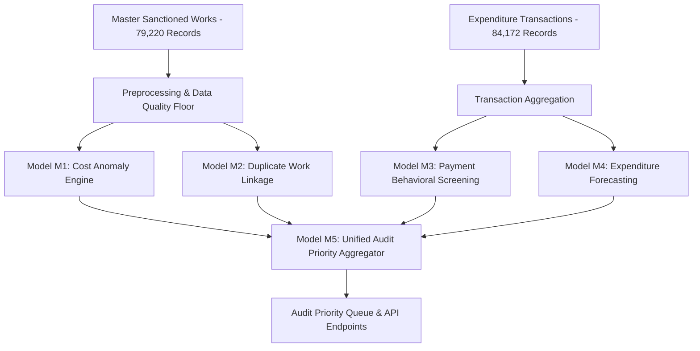

# SIH26102 — Architecture Truth Document
**SIH 2026 | Problem Statement: SIH26102**  
**AI-Powered MPLADS Audit Intelligence Platform — Team CodeBlooded**  

---

## 1. Executive Summary & System Taxonomy

The **SIH26102 MPLADS Audit Intelligence Platform** is an empirical decision-support system designed for MoSPI, State Nodal Authorities, District Authorities, and MP Offices to triage, benchmark, and prioritize administrative audit reviews.

Ground truth fraud labels do not exist in public government datasets; therefore, all models function as **unsupervised risk triage and audit prioritization signals**.

---

## 2. Definitive Production Architecture (Models M1–M5)

### 2.1 Model M1 — Cost Estimate Anomaly Engine
- **Canonical Model**: Scikit-Learn IsolationForest (`n_estimators=300`, `contamination=0.05`, `random_state=42`) + Robust Peer-Group IQR/MAD statistics.
- **Operating Point Terminology**: 5.02% of works were assigned to the configured Isolation Forest anomaly operating point. (Not presented as validated fraud prevalence).
- **Leakage Fencing**: Fenced strictly to sanction-stage features (`log_sanction_amount`, `robust_dev_filled`, `peer_dev_ratio_filled`, `days_filled`). Fit on training split.
- **Diagnostic Benchmark**: `ScratchIsolationForest` in `research/benchmark/diagnostics/scratch_ml_components.py` evaluated for diagnostic comparison.

### 2.2 Model M2 — Duplicate Work Linkage Engine
- **Canonical Model**: Geographic Candidate Blocking (`State + District + Work Category`) -> TF-IDF Vectorizer + Cosine Similarity Matching ($>90\%$ similarity threshold).
- **funNLP Integration**: Text cleaning and structural noise filtering executed before TF-IDF vectorization. Semantically meaningful domain terms (`road`, `school`, `hospital`, `hall`, `construction`, `bridge`) strictly preserved.
- **Output Standard & Candidate Isolation**: Candidate pairs requiring review are tagged as `"POTENTIAL CROSS-HOUSE DUPLICATE — REQUIRES REVIEW"`. Original source records are preserved independently.

### 2.3 Model M3 — Expenditure & Payment Behavioral Screening Engine
- **Canonical Model**: Transaction-grain behavioral threshold screening heuristic (`num_payments >= 5` AND `total_spent > ₹500,000` AND `max_payment < ₹200,000`).
- **Nature**: Analytical behavioral screening heuristic (NOT a statutory limit or fraud classifier).

### 2.4 Model M4 — Expenditure Forecasting Engine
- **Canonical Model**: Recursive 3-Month Rolling Average Baseline over 6-month horizon.
- **Interval Designation**: Empirical 95% Expected Range ($[\mu - 1.96\sigma, \mu + 1.96\sigma]$).
- **Evaluation Design**: Recursive multi-step forecast evaluation over held-out period.
- **Performance Reporting**: M4 reduced MAE by 7.06% relative to the naive previous-month baseline on the evaluated LS18 held-out period (MAE: ₹34.49M, RMSE: ₹41.20M, WAPE: 18.42%, sMAPE: 19.81%).
- **Qlib Integration**: `compute_qlib_alpha_factors()` in `ml/model_4_forecasting/qlib_series_forecaster.py` evaluated for research benchmark factor generation.

### 2.5 Model M5 — Unified Audit Priority Aggregator Engine
- **Canonical Priority Tiers**:
  - `CRITICAL AUDIT PRIORITY`: `Score >= 0.50` OR `>= 2 Major Independent Signals`
  - `STANDARD AUDIT PRIORITY`: `0.20 <= Score < 0.50` OR `1 Major Independent Signal`
  - `LOW AUDIT PRIORITY`: `Score < 0.20` AND `0 Major Independent Signals`
- **Multi-Dimensional Weights**: Sum = 1.00 (`Cost Risk = 0.30`, `Speed & Delay = 0.25`, `Statutory Compliance = 0.25`, `Vendor Network = 0.10`, `Eligibility & Beneficiary = 0.10`).
- **Supporting Signal Invariant**: Secondary/supporting dimensions alone cannot trigger `CRITICAL AUDIT PRIORITY`.

---

## 3. Statutory Compliance (45-Day Window Wording)

Sanction-process SLA monitoring evaluates delays against the **applicable 45-day communication/rejection window** (or statutory 75-day sanction window where applicable). All compliance signals avoid claiming that every sanction must occur within 45 days.

---

## 4. Supporting Tooling Classification (Four External Repositories)

1. **funNLP**: Production Preprocessing Support (text normalization & noise filtering).
2. **ML-From-Scratch**: Research / Benchmark / Diagnostic comparison (does not mutate canonical outputs).
3. **Qlib**: Optional Research / Benchmark factor generation (does not mutate canonical outputs).
4. **Netron**: Supporting Visualization / Architecture Inspection (`output/model_architecture_graph.json`).

---

## 5. Database & Storage Architecture

- **Local Analytical Engine & File Artifact Store**: Pipeline outputs are generated as structured JSON/CSV files in `output/`.
- **Backend API Service**: Flask application with high-performance in-memory caching reading directly from `output/`.
- **Production Target Database**: PostgreSQL / Supabase for multi-tenant relational persistence and authentication in cloud deployment.
- **SQLite Status**: Local development / cache / test database; not the active production file pipeline store.

---

## 6. RS Sitting vs Retired Identity Audit & Combined Master Breakdown

- **RS Sitting vs RS Retired Identity**: 
  - RS Sitting unique Work IDs: **19,607**
  - RS Retired unique Work IDs: **19,607**
  - `intersection_count`: **19,607** (100% Work ID overlap)
  - `sitting_only_count`: **0**, `retired_only_count`: **0**, `union_count`: **19,607**
  - `exact_identical_rows`: **19,606** out of 19,607.
  - Conclusion: RS_SITTING and RS_RETIRED represent two historical snapshot views of the same 19,607 Rajya Sabha work entities.

- **Combined Master Entity Count Breakdown**:
  - **Total Corpus Records**: **210,551** (LS18: 79,220, LS17: 92,117, RS_SITTING: 19,607, RS_RETIRED: 19,607).
  - **Unique Source Works**: **190,944** (LS18: 79,220 + LS17: 92,117 + RS Unique: 19,607).
  - **Overlapping Records**: **19,607** (RS_RETIRED Work IDs overlapping 100% with RS_SITTING).

- **Source ID Preservation**:
  - `source_work_id` preserved for every record.
  - `canonical_work_key` formed as `CORPUS + "|" + source_work_id` guaranteeing 0 collisions across 210,551 corpus records.
